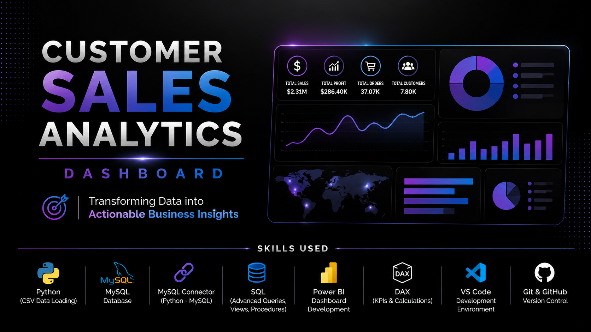
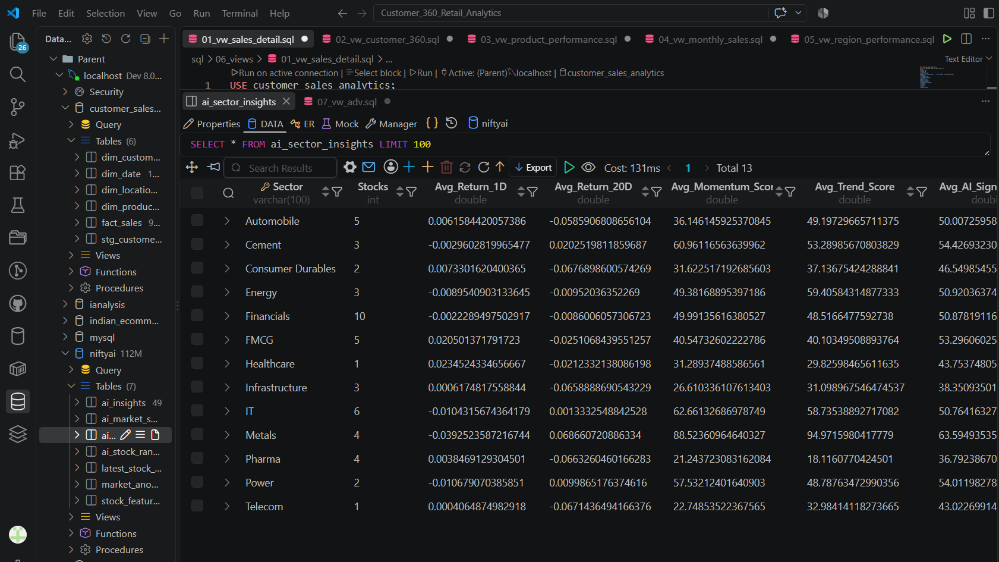
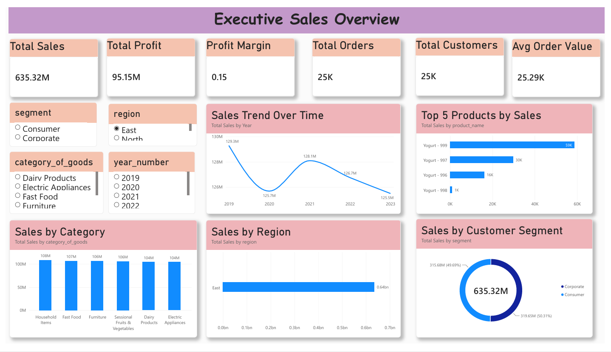
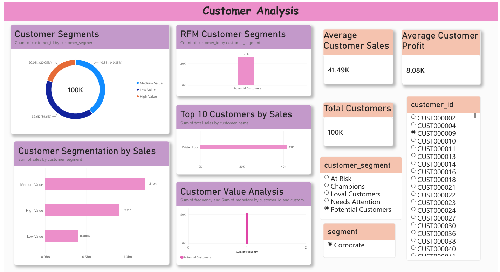
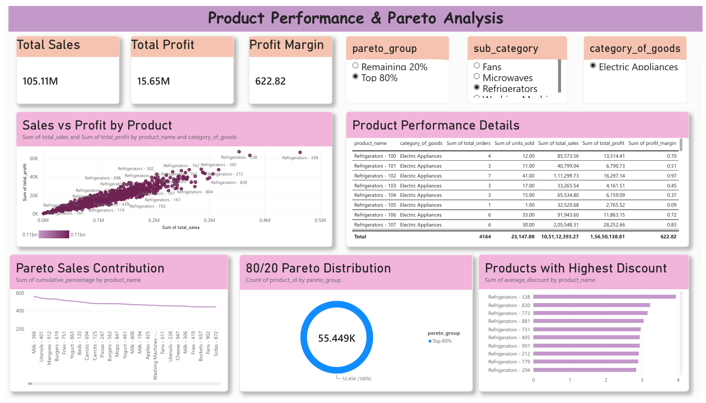
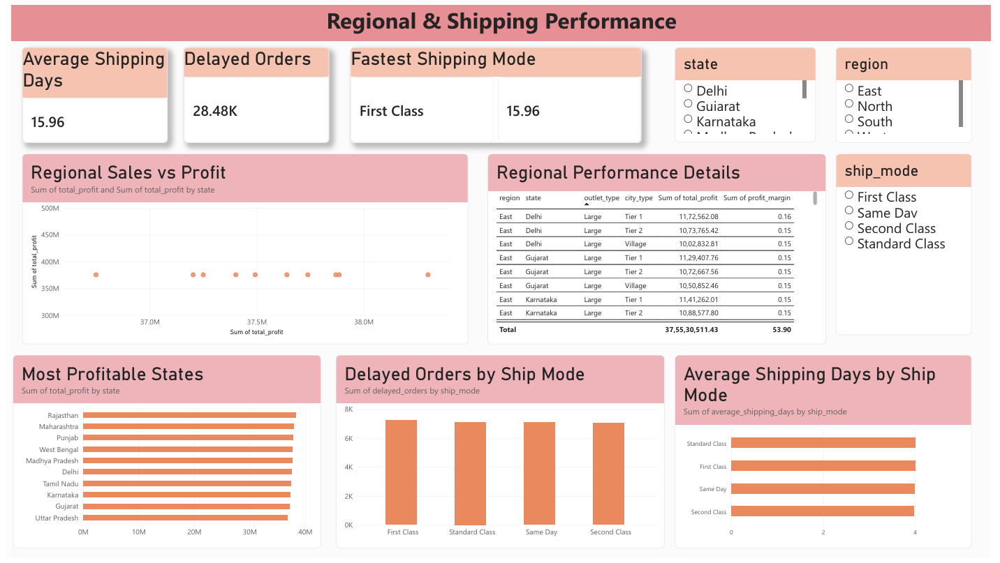

# Customer Sales Analytics Dashboard
## Customer Sales Analytics Dashboard


## Project Overview

Customer Sales Analytics is an end-to-end Data Analytics project focused on analyzing sales performance, customer behavior, product performance, regional performance, and shipping operations.

The project demonstrates a complete analytics workflow using **Python, MySQL, SQL, VS Code, MySQL Connector, and Power BI**.

Python was used specifically to load CSV data into MySQL using MySQL Connector. After the data was loaded, all database design, data modeling, SQL analysis, views, stored procedures, and advanced queries were developed using **MySQL and SQL**.

The final analytical data was loaded into Power BI to create an interactive multi-page business dashboard.

---

# Project Workflow

```text
CSV Dataset
     ↓
Python
(CSV Data Loading)
     ↓
MySQL Connector
     ↓
MySQL Database
     ↓
Database & Star Schema Design
     ↓
Advanced SQL Queries
     ↓
Views & Stored Procedures
     ↓
Power BI
     ↓
DAX & Interactive Dashboard
````

---

# Technologies Used

| Technology      | Purpose                                                    |
| --------------- | ---------------------------------------------------------- |
| Python          | Loading CSV data into MySQL                                |
| MySQL Connector | Connecting Python with MySQL                               |
| MySQL           | Database creation, data modeling, and analysis             |
| SQL             | Views, procedures, advanced queries, and business analysis |
| VS Code         | Development environment                                    |
| Power BI        | Data modeling and dashboard development                    |
| DAX             | KPI and business calculations                              |
| Git & GitHub    | Version control and project documentation                  |

---

# Data Loading

The source dataset was provided in CSV format.

Python was used specifically to load the CSV data into the MySQL database using MySQL Connector.

The data loading process included:

* Reading CSV files using Python
* Establishing a connection to MySQL
* Loading data from CSV files into MySQL tables

After the data was successfully loaded, the remaining work was completed using **MySQL, SQL, and Power BI**.

---

# Database Design

The database was created and developed in MySQL.

The database structure was designed using a **Star Schema** to support efficient analytical queries and Power BI reporting.

The model consists of:

* One central fact table
* Multiple dimension tables

---

# Data Model

## Fact Table

### `fact_sales`

Contains transactional sales information including:

* Order ID
* Customer Key
* Product Key
* Location Key
* Sales Date Key
* Order Date Key
* Ship Date Key
* Sales
* Quantity
* Discount
* Profit
* Ship Mode

---

## Dimension Tables

### `dim_customer`

Contains customer-related information such as:

* Customer ID
* Customer Name
* Last Name
* Segment

### `dim_product`

Contains product information such as:

* Product ID
* Product Name
* Sub Category
* Category of Goods

### `dim_location`

Contains geographical and location information such as:

* Region
* State
* Country
* City Type
* Outlet Type

### `dim_date`

Contains date attributes used for time-based analysis.

---

# Star Schema

```text
                dim_customer
                     |
                     |
dim_product ---- fact_sales ---- dim_location
                     |
                     |
                  dim_date
```

The `fact_sales` table stores transactional data, while the dimension tables provide descriptive information for filtering and analysis.

---

# SQL Analysis

After loading the data into MySQL, SQL was used for:

* Database development
* Table creation
* Data relationships
* Star Schema design
* Views
* Stored procedures
* Advanced analytical queries
* Customer analysis
* Product analysis
* Regional analysis
* Shipping analysis
* Data quality checks

---

# SQL Views

Reusable SQL views were created to provide analytical datasets for Power BI.

Key views include:

* `vw_sales_detail`
* `vw_customer_360`
* `vw_product_performance`
* `vw_monthly_sales`
* `vw_region_performance`
* `vw_data_quality`
* `vw_rfm_analysis`
* `vw_pareto_analysis`
* `vw_customer_segmentation`
* `vw_shipping_performance`

These views allow complex SQL business logic to be reused in Power BI reporting.

---

# Stored Procedures

Stored procedures were created for reusable analysis.

Examples include:

* Sales summary for a selected date range
* RFM analysis

The sales summary procedure allows users to analyze:

* Total Orders
* Total Customers
* Total Quantity
* Total Sales
* Total Profit
* Profit Margin

based on a selected date range.

---

# Advanced SQL Analysis

The project demonstrates several advanced SQL concepts.

## Common Table Expressions (CTEs)

CTEs were used to break complex analytical queries into smaller and more readable steps.

Examples include:

* Customer metrics
* Product sales analysis
* Monthly sales analysis
* RFM calculations
* Pareto analysis
* Cohort analysis

---

## Window Functions

Window functions were used for analytical calculations without collapsing the result set.

Functions used include:

* `RANK()`
* `DENSE_RANK()`
* `NTILE()`
* `LAG()`
* `SUM() OVER()`
* `PARTITION BY`

---

## Customer Segmentation

Customers were classified based on their sales and profitability.

Segments include:

* High Value
* Medium Value
* Low Value
* Loss Making

The segmentation thresholds were adjusted based on the actual distribution of customer sales in the dataset.

---

## RFM Analysis

Customers were analyzed using:

### Recency

How recently a customer made a purchase.

### Frequency

How frequently a customer placed orders.

### Monetary Value

How much a customer spent.

Customers were assigned RFM scores using `NTILE()` and categorized into segments such as:

* Champions
* Loyal Customers
* Potential Customers
* At Risk
* Needs Attention

---

## Pareto Analysis

Pareto analysis was performed to identify products contributing to the majority of total sales.

The analysis calculates:

* Total Product Sales
* Grand Total Sales
* Cumulative Sales
* Cumulative Sales Percentage

Products were classified into:

* Top 80%
* Remaining 20%

---

## Customer Cohort Analysis

Customers were grouped based on their first purchase period.

The analysis calculates the first purchase date for each customer and assigns them to a cohort month.

This provides a foundation for future customer retention analysis.

---

## Sales Ranking and Contribution

Window functions were used to calculate:

* Customer Sales Rank
* Customer Profit Rank
* Sales Contribution Percentage

---

## Year-to-Date Sales

Cumulative sales were calculated within each year using:

```sql
SUM(monthly_sales) OVER(
    PARTITION BY year_number
    ORDER BY month_number
)
```

This provides Year-to-Date sales performance.

---

## Month-over-Month Growth

The `LAG()` function was used to compare monthly sales with the previous month.

The analysis calculates:

* Previous Month Sales
* Sales Change
* Growth Percentage

---

## Sales Anomaly Detection

Daily sales were analyzed using statistical calculations.

Metrics include:

* Average Daily Sales
* Standard Deviation
* Z-Score

Sales records were classified as:

* Normal
* Potential Anomaly
* Extreme Anomaly

---

## Top Products by Category

`DENSE_RANK()` was used to identify the top-performing products within each product category.

---

## Shipping Performance

Shipping performance was analyzed using order and shipping dates.

Metrics include:

* Average Shipping Days
* Minimum Shipping Days
* Maximum Shipping Days
* Delayed Orders
* Ship Mode

---

# Data Quality Analysis

A dedicated SQL view was created to identify potential data quality issues.

Checks include:

* Missing Sales
* Negative Sales
* Missing Quantity
* Invalid Quantity
* Invalid Discount
* Invalid Shipping Dates
* Date inconsistencies

---

# Challenges Faced and Solutions

## 1. Loading CSV Data into MySQL

### Challenge

The dataset was provided in CSV format and needed to be loaded into a structured MySQL database.

### Solution

Python was used to read and load the CSV data into MySQL using MySQL Connector.

After loading the data, all database design and analytical work was completed using MySQL and SQL.

---

## 2. Designing a Relational Data Model

### Challenge

The dataset contained information related to customers, products, locations, orders, and dates.

Keeping all information in one table would make analytical queries difficult to manage.

### Solution

A Star Schema was created with:

* A central `fact_sales` table
* Customer dimension
* Product dimension
* Location dimension
* Date dimension

This structure improved data organization and analytical querying.

---

## 3. Reusing Complex SQL Logic

### Challenge

Analyses such as RFM, Pareto analysis, customer segmentation, and shipping performance required complex SQL queries.

Repeating these queries for every Power BI visual would make the reporting process inefficient.

### Solution

Reusable SQL views were created.

Power BI could then load the results of these analytical views directly.

---

## 4. Customer Segmentation Thresholds

### Challenge

The initial customer segmentation thresholds did not match the actual sales distribution of the dataset.

Most customers were initially classified into the same category.

### Solution

The customer sales range was examined and the segmentation thresholds were adjusted to better match the dataset.

This resulted in more meaningful customer segmentation.

---

## 5. Percentage Calculation Issues

### Challenge

Some percentage calculations initially produced very small decimal values or appeared as zero.

### Solution

The calculations were reviewed and corrected by handling division and percentage conversion correctly.

Percentage formatting was also adjusted in Power BI.

---

## 6. Division by Zero

### Challenge

Calculations such as profit margin and growth percentage can result in errors when the denominator is zero.

### Solution

`NULLIF()` was used in SQL calculations.

Example:

```sql
SUM(profit) / NULLIF(SUM(sales), 0)
```

This prevents division-by-zero errors.

---

## 7. Integrating SQL Analysis with Power BI

### Challenge

Different SQL views contained different levels of aggregation.

Connecting every advanced analytical view directly to the main Power BI data model could create unnecessary relationship complexity.

### Solution

The core fact and dimension tables were used for the main Power BI data model.

Advanced SQL views were loaded separately and used for focused analytical visuals.

This allowed the project to demonstrate both SQL analysis and Power BI reporting.

---

# Power BI Dashboard

The final Power BI report contains four focused pages.

---

## 1. Executive Sales Overview


Provides a high-level overview of business performance.

Includes:

* Sales KPIs
* Profit KPIs
* Sales trends
* Regional performance
* Category performance
* Top products

---

## 2. Customer & RFM Analysis


Focuses on customer behavior and customer value.

Includes:

* Customer performance
* Customer segmentation
* RFM analysis
* Top customers
* Customer value distribution

---

## 3. Product & Pareto Analysis


Focuses on product performance and profitability.

Includes:

* Product sales
* Product profit
* Profit margin
* Sales versus profit analysis
* Discount analysis
* Pareto analysis
* Product performance details

---

## 4. Regional & Shipping Performance


Focuses on regional performance and operational efficiency.

Includes:

* Regional profitability
* State performance
* Shipping performance
* Average shipping days
* Delayed orders
* Ship mode analysis

---

# Power BI Features

The Power BI dashboard demonstrates:

* Data Modeling
* Relationships
* DAX Measures
* KPIs
* Cards
* Bar Charts
* Column Charts
* Line Charts
* Scatter Charts
* Donut Charts
* Tables
* Matrices
* Slicers
* Filters
* Dashboard Navigation
* Visual Formatting
* Interactive Reporting

---

# Key DAX Measures

Examples include:

```DAX
Total Sales =
SUM(fact_sales[sales])
```

```DAX
Total Profit =
SUM(fact_sales[profit])
```

```DAX
Total Quantity =
SUM(fact_sales[quantity])
```

```DAX
Total Orders =
DISTINCTCOUNT(fact_sales[order_id])
```

```DAX
Average Order Value =
DIVIDE(
    [Total Sales],
    [Total Orders]
)
```

```DAX
Profit Margin =
DIVIDE(
    [Total Profit],
    [Total Sales]
)
```

---

# Project Structure

```text
Customer-Sales-Analytics/
│
├── data/
│   └── CSV files
│
├── python/
│   └── data_loading.py
│
├── sql/
│   ├── 01_database/
│   ├── 02_tables/
│   ├── 03_indexes/
│   ├── 04_data_validation/
│   ├── 05_views/
│   ├── 06_procedures/
│   ├── 07_advanced_queries/
│   └── 08_analysis/
│
├── powerbi/
│   └── Customer_Sales_Analytics.pbix
│
├── screenshots/
│   ├── 01_executive_overview.png
│   ├── 02_customer_rfm_analysis.png
│   ├── 03_product_pareto_analysis.png
│   └── 04_regional_shipping_performance.png
│
├── README.md
│
└── .gitignore
```

---

# Key Skills Demonstrated

## Python

* CSV Data Loading
* MySQL Database Connectivity

## SQL / MySQL

* Database Creation
* Table Design
* Star Schema Design
* Fact and Dimension Tables
* Views
* Stored Procedures
* CTEs
* Window Functions
* Advanced SQL Queries
* Customer Analysis
* Product Analysis
* Regional Analysis
* Shipping Analysis
* Data Quality Validation

## Power BI

* Data Modeling
* DAX
* KPI Development
* Interactive Dashboards
* Slicers and Filters
* Dashboard Navigation
* Business Reporting

---

# Key Business Questions Answered

The project helps answer questions such as:

* How is the business performing overall?
* How are sales changing over time?
* Which customers generate the most value?
* Which customers are loyal or at risk?
* Which products contribute the most to sales?
* Which products are profitable?
* Does the Pareto principle apply to product sales?
* Which regions and states perform best?
* Which shipping modes are most efficient?
* How many orders are delayed?
* Are there potential data quality issues?

---

# Conclusion

This project demonstrates an end-to-end Data Analytics workflow.

```text
CSV Data
→ Python Data Loading
→ MySQL Connector
→ MySQL Database
→ Star Schema
→ Advanced SQL
→ Views & Procedures
→ Power BI
→ DAX
→ Interactive Dashboard
```

The project demonstrates practical skills required for a Data Analyst role, including relational database design, advanced SQL analysis, Python-to-MySQL data loading, business analysis, and Power BI dashboard development.

```

